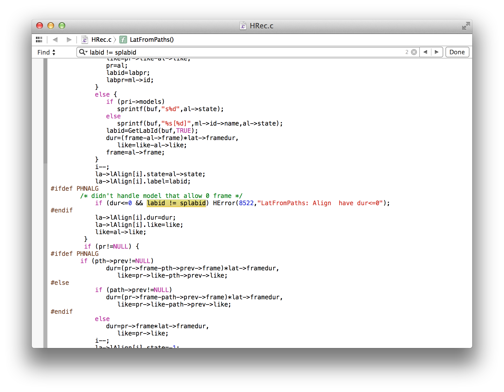

# FAVE-align

* [Installation](#installation)
  * [Dependencies](#dependencies)
    * [HTK 3.4.1](#htk-341)
      * [OS X](#os-x)
        * [Command Line Tools](#command-line-tools)
            * [Lion & Mountain Lion (10.7 & 10.8)](#lion--mountain-lion-107--108)
            * [Mavericks (10.9)](#mavericks_109)
        * [Intalling X11](#installing-x11)      
        * [Download HTK](#download-htk)     
        * [Fixing HTK Source](#fixing-htk-source)
        * [Installing HTK](#installing-htk)
    * [sox](#sox)
* [Usage](#usage)

## Installation

### Dependencies

FAVE-align depends on **HTK** and **sox** to work. 
As such, you'll need to have these installed.

#### HTK 3.4.1
##### OS X
From OS X 10.7 onwards (Lion, Mountain Lion and Mavericks), you'll need to install Command Line Tools and X11 before moving forward in the rest of the installation.
Then you'll have to download the HTK code, and fix a bug in its source code. These steps are documented here.

* [Command Line Tools](#command-line-tools)
    * [Lion & Mountain Lion (10.7 & 10.8)](#lion--mountain-lion-107--108)
    * [Mavericks (10.9)](#mavericks_109)
* [Intalling X11](#installing-x11)           
* [Fixing HTK Source](#fixing-htk-source)
* [Installing HTK](#installing-htk)

###### Command line tools
* [Lion & Mountain Lion (10.7 & 10.8)](#lion--mountain-lion-107--108)
* [Mavericks (10.9)](#mavericks_109)

It is necessary to install a C compiler. 
If you already know how to do this, skip down to [Fixing HTK Source][#fixing-htk-source]. 
If you are not sure whether you have a C compiler installed, open the Terminal application and type

    gcc -v

If you see `-bash: gcc: command not found`, then you need to install the C compiler. 
Directions for that follow, but depend on your version of OS X.

* ([Directions for OS X Lion and Mountain Lion (10.7 & 10.8)](#lion--mountain-lion-107--108))
* ([Directions for OS X Mavericks 10.9](#mavericks_109))

###### *Lion & Mountain Lion (10.7 & 10.8)*

You need to install command line tools and X11.
The here are the steps involved:

1. Go to the [Mac Dev Center](https://developer.apple.com/devcenter/mac/index.action), register (for free) and log in.
2. Go to Downloads, and and then View All Downloads.
3. Search for "command line tools."
4. Download and install the version appropriate for your operating system.

A graphical representation:

*1. Register and login*

*2. Downloads*

*2. View All Downloads*

*3 & 4. Search for "command line tools" and download*

###### *Mavericks (10.9)*

To install Command Line Tools in OS X Mavericks (10.9), just open the Terminal Application, and type

`xcode-select --install`

Just select "Install" in the window which pops open.

###### Installing X11

Go to http://xquartz.macosforge.org/, download XQuartz from there and install it using the installer.

###### Download HTK

You'll need to register (free) with HTK to download it.
Visit http://htk.eng.cam.ac.uk/register.shtml to register, and they will e-mail you a password.

After that, visit http://htk.eng.cam.ac.uk/download.shtml, and download the HTK source code under Linux/Unix downloads.

After downloading HTK, unpack the `.tar.gz` file, which will unpack into a directory called "htk".

###### Fixing HTK Source

In the htk directory, navigate to htk>HTKLib, and open the file HRec.c in a plain text editor.

Find the line 1626 which reads

    if (dur<=0 && labid != splabid) HError(8522,"LatFromPaths: Align  have dur<=0");

`labid` in this line should be changed to `labpr`.
It should look like this:

    if (dur<=0 && labpr != splabid) HError(8522,"LatFromPaths: Align  have dur<=0");

###### Installing HTK

* htk/HTKlib/HRec.c
	* `labid
!=
splabid` -> `labpr
!=
splabid`	

#### sox
#### OS X

## Usage
